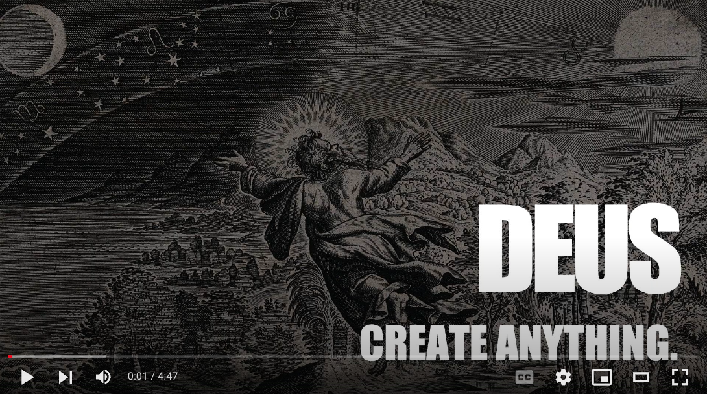
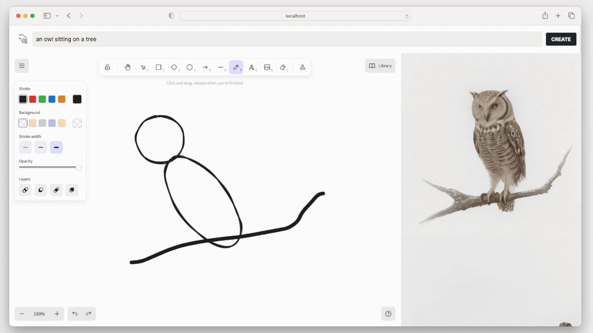

# DEUS

> A Realtime Creation Engine

DEUS is a super flexible REALTIME image generation engine, powered by StableDiffusion and LCM Lora.


# How it works

Watch the video:

[](https://www.youtube.com/watch?v=g8OiyHjlbbM)

# What is different about deus?

1. **Realtime Native:** Unlike many image generation web UIs, DEUS is designed from scratch with an assumption that images are generated in realtime, which opens doors to various unique features.
2. **Simple:** If you know how to use Google, and know how to draw, you know how to use DEUS.
3. **Intutitive:** Just enter what you want, drag and drop images, and draw. The combination of these simple actions lets you gradually create exactly what you want, without having to learn any complicated tech and jargon.

# Features

## 1. Text Prompt

Generate images in realtime as you type


## 2. Draw

Draw things onto the canvas to generate images in realtime


## 3. Remix

The ultra-fluid UI lets you "breed" new images simply by dragging and dropping generated images into the canvas.



## 4. Import

You can also easily drag and drop any online image into DEUS.


# Install

There are two ways to install: Manual and 1-Click Install.

## 1 Click Install (RECOMMENDED)

Just find DEUS from [Pinokio](https://pinokio.computer) and click "Install":

1-Click Install link: https://pinokio.computer/item?uri=https://github.com/cocktailpeanut/deus


## Manual Install

First clone the repository:

```
git clone https://github.com/cocktailpeanut/deus
cd deus
```

Next, move in to the server folder with `cd server`, and install the server:

```
# create a venv
python -m venv env
source env/bin/activate

# Install the correct version of pytorch for your machine
npx torchcraft
pip install -r torchcraft.txt

# Install the rest of the requirements
pip install -r requirements.txt
```

Finally, move to the client folder with `cd ..` and then `cd client`, and install the client:

```
npm install
```

# Usage

## 1 Click Launcher (RECOMMENDED)

When using Pinokio, all you need to do is just click "Launch" from Pinokio:


## Manual Launch

First, switch to the `deus/server` folder and start the server:

```
source env/bin/activate
uvicorn app:app
```

Next, switch to the `deus/client` folder start the nextjs server for the client:

```
npm run dev
```

Now open the browser at http://localhost:3000
